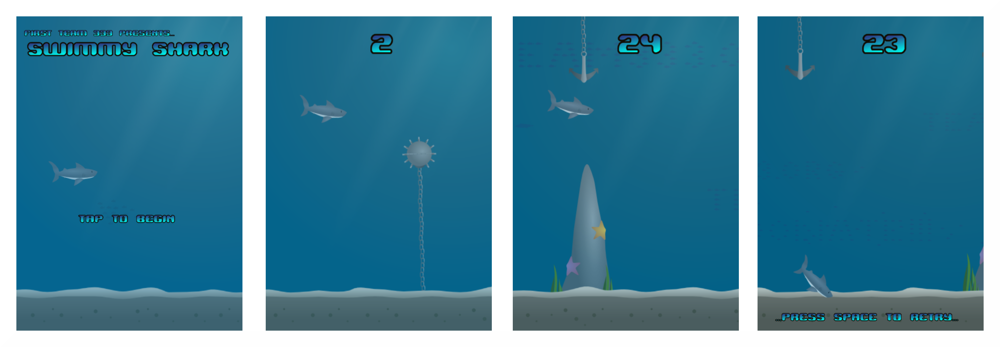

# Intro
This game is a more polished version of [this](github.com/TheQYD/swimmy-shark) one. It was made to promote
FRC Team 333, The Megalodons.

# Where to Play.
- [Here on Github](http://theqyd.github.io/swimmy-shark-v.2/).
- It's available as an Android [app](https://play.google.com/store/apps/details?id=com.swimmy.shark&hl=en).
- Clone it and add it to your webserver.
- Download it. Unzip it. Add it to your webserver.

# How to Play.
You are a shark. Avoid the obstacles in the ocean. It's like Flappy Bird, but worse.

# Credits.
- Code: Qasim Dove <emailqasim@gmail.com>
- Graphics: Qasim Dove <emailqasim@gmail.com>

# Misc
You can play a more the 24hr challenge version [here](https://github.com/TheQYD/swimmy-shark) (unpolished).

# License
Swimmy Shark is available under the CC0 1.0 license. See the LICENSE file for more info.

# Notes
All assets are under the Creative Commons CC0 1.0 License. 

All of the sounds belong to their rightful owners at "freesound.org". The following is a list of all sounds
used and their creators.

    "explosion.wav" - "waterxplo.wav" by inferno
    "bleep.wav" - "8-bit Coin.aif" by timgormly
    "fall.wav" - "Slide Whistle up 04.wav" by FreqMan
    "punch.wav" - "punch.wav" by Ekoubza123
    "swim.wav" - "bubbles (2).wav" by Glaneur de sons
    "underwater.wav" - "underwater" by yosarrian
    
The majority of these sounds were edited using Audacity. Fonts used:

    "jawbreaker.fnt" - "Jawbreaker" by Ænigma
    "le fish.fnt" - "Le Fish" by zanatlija

All fonts were retrieved from "dafont.com". 

The Mentors of Team 333:

- Mr. F. Dispenza
- Mr. Mike V.
- Ms. Nelly R.
- Mr. Adel A.
